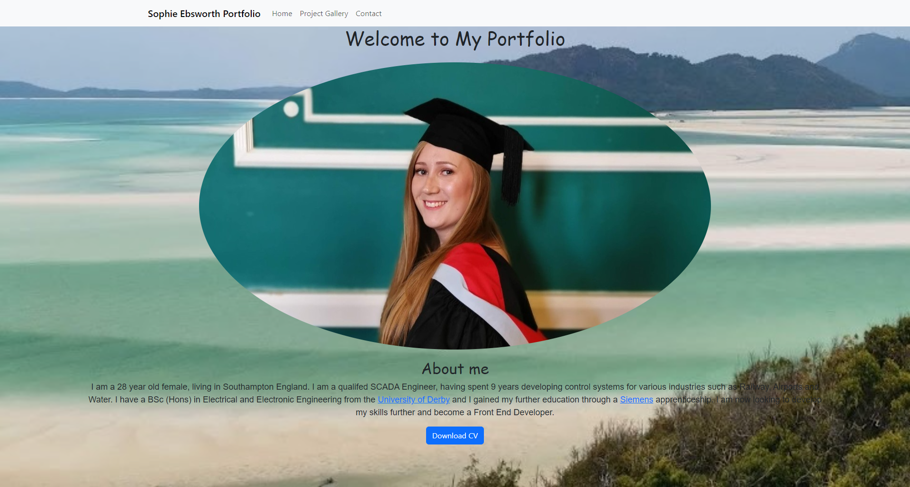
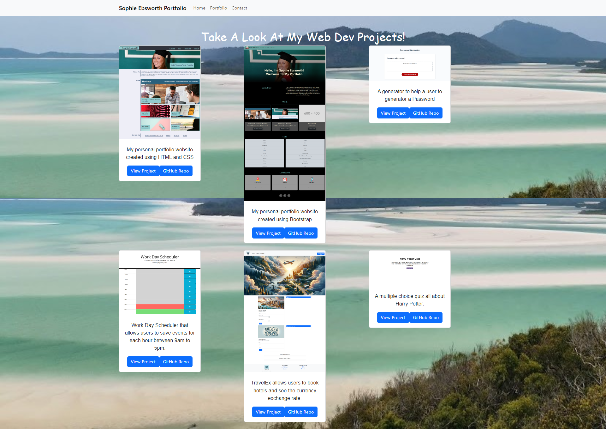
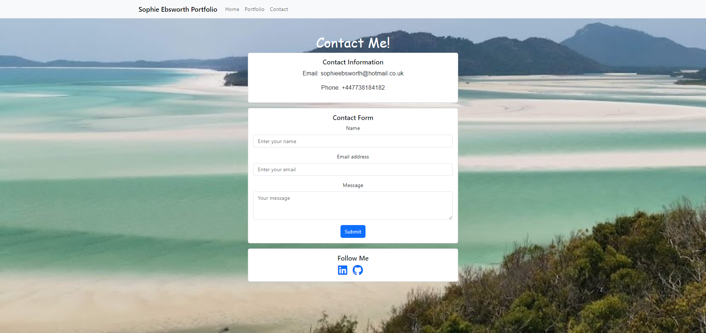

# Sophie Ebsworth React Portfolio
## Table of Contents

* [Description](#description)
* [Links](#links)
* [Screenshots](#screenshots)
* [Usage](#usage)
* [Technologies Used](#technologies-used)
* [Tests](#tests)
* [Credits](#credits)
* [Questions](#questions)

## Description

This application uses React to build my portfolio website.

## Links

[Deployed application on GitHub Pages](https://sophieebby.github.io/react-portfolio/)

## Screenshots

Home page:

Project Gallery:

Contact page:

## Usage

This project is intended to be used as my website and portfolio.

## Technologies Used

 

## Tests

npm run test

## Credits

Thank you to my tutor Laura Cole for teaching us the principles to be able to create this project. 

Thank you to the lesson material and videos that I used to develop the project. 

Thank you to ChatGPT for helping me solve code issues.

## Questions

If you have further questions, you can reach me at sophieebsworth@hotmail.co.uk. For more of my work, see [my GitHub](https://github.com/SophieEbby).